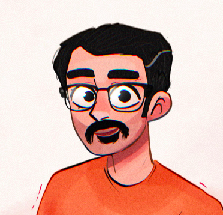

  

همونطور که مشخصه، من امین رشیدبیگی هستم. کارم مربوط به کامپیوتره و اینجا رو ساختم که در مورد چیزهایی که یاد می‌گیرم و یا بلدم بنویسم.

من از وقتی یادم میاد ساختن رو خیلی دوست داشتم. وقتی که با کامپیوتر و اینترنت آشنا شدم، فهمیدم که برای ساختن به ابزارهای فیزیکی خیلی کمتری نیاز دارم. همون اوایل دوره دبیرستان شروع به ساختن وبسایت [تارمستر](https://aminrashidbeigi.github.io/fa/side-projects/#-%D9%88%D8%A8%D8%B3%D8%A7%DB%8C%D8%AA-tarmaster) کردم. مثل همین وبسایت، اون موقع هم هدفم به اشتراک‌گذاری چیزهایی بود که یاد می‌گرفتم. به طور خاص در زمینه کامپیوتر.

بعدا که مطمئن شدم کامپیوتر اون مسیریه که می‌خوام برای مدت خیلی طولانی‌تری در پیش بگیرم، کنکور ریاضی دادم و وارد رشته مهندسی کامپیوتر توی دانشگاه امیرکبیر شدم. جایی که تقریبا همه بیشتر از من بلد بودن و چند قدم ازم جلوتر بودن. حالا که واضح‌تر می‌دیدم با لپتاپی که دستمه تا کجاها میشه پیش رفت، با انگیزه بیشتری درس خوندم، کار کردم، آزمون خطا کردم و تجربه کردم. کلی هم خوش می‌گذشت!

الان چندین ساله که مهندس نرم‌افزار هستم و دو ساله که وظیفه راهبری فنی یک تیم رو بر عهده دارم.

اگر سوالی داشتین و یا موردی بود که دوست داشتین در موردش گپ بزنیم بهم ایمیل بزنین: a.rashidbeigi @ gmail.com