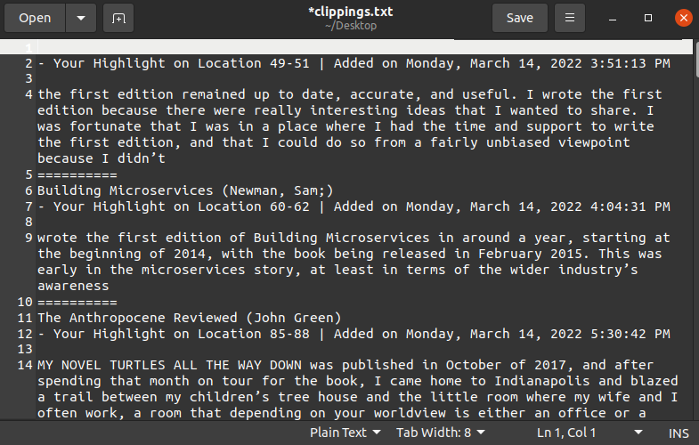
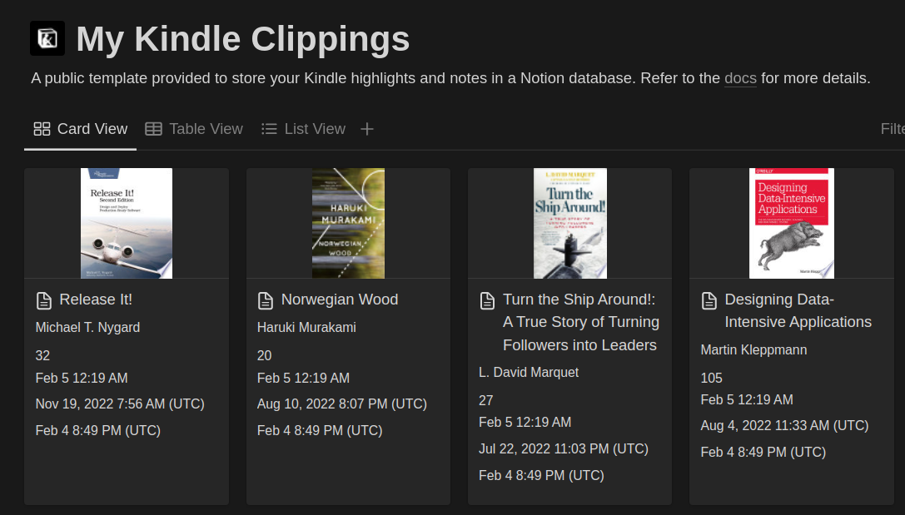

Highlighting non-fiction and technical books is very important to me. Both because I can review the books I've previously highlighted in a few minutes, and because I concentrate more on the section of the text when highlighting. One of the prominent advantages of reading books with e-readers is the better experience of highlighting. Without the need for a side tool, you can highlight and then quickly and with suitable classification go back to them. But when the number of these highlights increases, searching for them becomes harder, and finding the desired highlight among books and chapters is not an easy task.

This led me to try to find a way to have these highlights somewhere other than the e-reader itself; to be more durable and easier to search. The Kindle itself provides good facilities for exporting these highlights and is well compatible with very good tools like Readwise and Goodreads. However, these facilities are either only exclusively available for books purchased directly from Amazon, or their services come with a cost. As citizens from certain countries are unable to use these services, they are practically unusable for them. So, I tried to find a **free** way to transfer these highlights.

I use Notion for document storage. Here I want to write the methods I used to transfer these highlights to a Notion document.

## My Clippings.txt

All Kindle highlights are physically stored on the device's hard drive in a file called `My Clippings.txt` in the `documents` folder. It is better to copy this file onto your computer before anything else. Be careful not to cut or delete the file as your highlights in the device will be deleted.

This raw file is usable and can be viewed with simple tools like Windows Notepad or any other text editor.

## Transferring My Clippings.txt to Notion

Here, I'll write a few methods to convert this raw `My Clippings.txt` file into a more understandable and readable Notion document.

### Easy Way: Export Kindle Highlights to Notion Extension

I used this Google Chrome extension for a while and it was responsive. The usage guide is written in pictures in [this link](https://www.notion.so/KindleToNotion-How-To-Guide-Easy-bce19dae7fae4cde93440ece213ba5ed). You can download the extension from [here](https://chrome.google.com/webstore/detail/export-kindle-highlights/nmgbhgbkbenpfjkdfladebgcdihbekne).

_Note: This extension did not work for me after a while. Of course, I didn't figure out why, and it may still be usable._

### Harder Way: Open Source Software Kindle2Notion

For this method, you need to have Python3 installed on your operating system. You can see the instructions in the [project repository](https://github.com/paperboi/kindle2notion). I've been using this method for a while now. In case this is useful for you as well, don't forget to support the writers of this project by giving a star to the repository.

—

If you know another way to transfer Kindle highlights to Notion or if you have a better way to use the highlights, I'd be happy if you write in the comments so I can add to the original content.