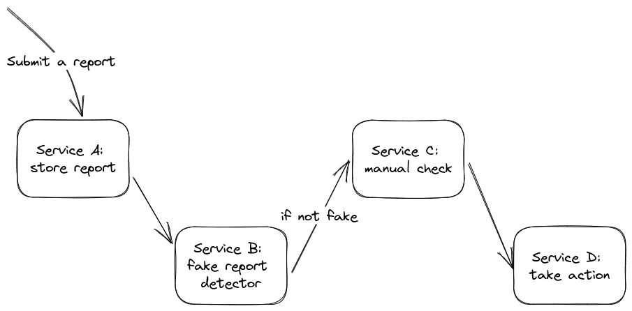

When you join a new team, you are usually bombarded with a lot of information. You need to familiarize yourself with the company's culture, facilities, and colleagues. Initially, the onboarding process tends to be welcoming and hospitable. However, after a few days, you are expected to quickly learn about the products, services, and data in order to contribute effectively. It can be overwhelming to try to absorb and utilize all of this information, and eventually, the honeymoon phase ends, leaving you feeling stressed and concerned about your credibility.

Years ago, as a junior, I joined a team of four senior software engineers tasked with managing a massive product consisting of over 20 microservices. During my initial onboarding, the most senior team member responsible for my technical training held a session to explain each service in great detail. Despite the hour-long explanation, I understood very little but was afraid to admit it, fearing he would think I was not intelligent enough. I began coding without grasping the big picture of how my service contributed to the overall product. After two months of confusion, I finally comprehended the function of each microservice and how it contributed to the product.

After years had passed, I had become the most senior software engineer on the team and was responsible for the onboarding process of new members. I could still remember the struggles I faced during my own onboarding, and so I decided to make the experience better for others. After adding the storytelling to the onboarding process, I noticed that the new team members were able to comprehend the system much faster than I had expected.

In this article, I will offer some tips that may help you to enhance the onboarding process and increase its efficiency through storytelling. To illustrate this, I will use the example of a new employee joining a fraud detection team at a company.

I should mention that this article could be useful for anyone who has to onboard a new member or design the onboarding process for a company.

## 1. Start with a little bit of history
Starting with the company's and the team's history will help the new employee to understand the purpose of the team. This helps the new employee understand why certain services, infrastructure, and the product they will be building are necessary. You can do this by:

- Provide some background information to the new employee to contextualize the current product.
- Explain the team or company's mission and vision, emphasizing why this mission is crucial to the company.
- Describe the problem that existed before and why the chosen solution was deemed appropriate.

In the case of a fraud detection team, it is essential to explain why fraud detection is crucial for the company. Outline what was done before, the users' pain points, and how the team and services were initiated.

## 2. Tell the story of the users' journey
To effectively onboard new employees to a system, it's best to explain it through a story. This could be from the perspective of a user or a request.

In our example, there are two approaches:

**Approach A:** The first approach is to list all the services and their dependencies and explain them one by one. For instance, in our system, there are four services: Service A, Service B, Service C, and Service D. Service A saves user reports, Service B checks the fake-report-detector bot's opinion, Service C serves a panel to check the report manually, and Service D decides whether the report is valid or not and takes action.

**Approach B:** The second approach is to start with the user's touchpoint and explain the report request journey. For example, when a user clicks on "send report," the request is sent to Service A, which receives and saves the report's attributes, including the reporter's and report's details. It then sends the report to Service B, which collects the fake-report-detector bot's opinion. If the bot can't make a decision, it sends a request to Service C for manual review. After submission, Service D collects the bot's or Service C's opinion and takes action. If the report is valid, the user is banned for 10 days; otherwise, the report is ignored.

The first approach can make it easy for new employees to forget the services and their responsibilities, as well as how they are interconnected. In contrast, the second approach helps new employees visualize and memorize the relationships between the services more effectively.

## 3. Add some flavor by visualizing
When explaining the story of components to someone unfamiliar with them, they try to imagine the connections and interactions between them, and may even take notes. Why not provide this information before the onboarding session? You can create a visual representation of all the components and their interconnections.

This is a one-time job that can be used for future onboarding sessions and can save a lot of time. As a tip, it's better to use an editable tool to create the diagram since the components and their interactions may change over time. Instead of creating a new diagram for each onboarding, it's easier to simply edit the existing one.

*A simple flow of a report request*

## 4. Avoid low-level details at first
When new team member joins, they are usually overwhelmed with information. When it comes to technical information, it is better to provide a big picture that explains the components at a higher level of abstraction and how they contribute to the product and connect with each other. If you try to explain all of the details and exceptions right away, the new member may not understand the big picture and may miss important parts.

It is better to take your time to provide low-level details and do so through planned tasks instead of overwhelming the new joiner with all of the information at once.

---

Onboarding is one of the most important stages of one's career in a company. The way a new employee is onboarded can have a lasting impact on their career within the company. A negative experience may result in them leaving the company prematurely, while a positive experience can set the stage for a fulfilling and long-term relationship with the organization.

This article proposed some tips to make this experience better for new employees by adding storytelling to their onboarding process. I would like to know your thought; so please let me know your opinion regarding this post by dropping a comment.