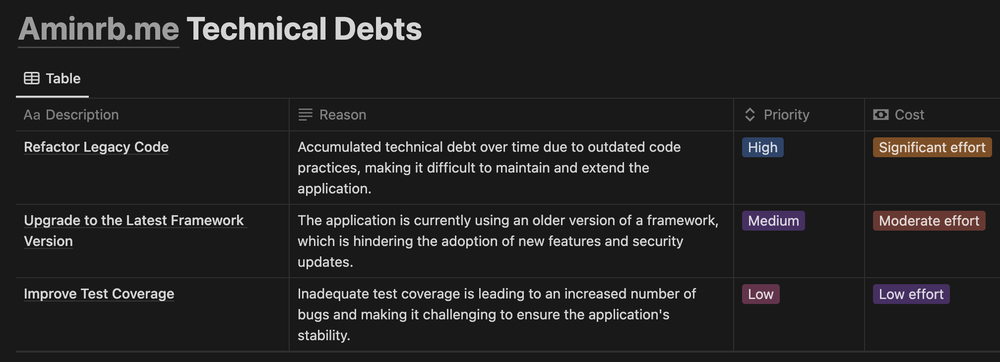

## مقدمه
بدهی‌های فنی عضو جدا ناپذیر توسعهٔ یک محصول هستن. با وجود این که عموماً بار معنایی منفی دارن، اما به وجود آوردنش لزوماً تصمیم معیوبی نیست؛ بلکه همونطور که از اسمش پیداست، یک چیزی رو قرض می‌گیریم که در آینده و در فرصت بهتری بهاش رو پرداخت کنیم. همونطور که Uncle Bob در [این مقاله](https://sites.google.com/site/unclebobconsultingllc/a-mess-is-not-a-technical-debt) اشاره می‌کنه، بعضی مواقع برای سریع‌تر به نتیجه رسیدن و آزمایش کردن یک تغییر در محصول، خیلی مفید خواهد بود که کمی از استانداردهای فنی بکاهیم و به بهای گرفتن نتیجهٔ سریع‌تر، یک بدهی فنی به بار بیاریم. اما باید حواسمون باشه که هر نوع کاهش استاندارد رو به حساب بدهی فنی نذاریم. همونطور که در [این پست](https://t.me/aminrbg/6) کانال تلگرامم اشاره کرده بودم، اگر بدهی فنی رو آگاهانه و با ملاحظه به وجود بیاریم، اتفاق مثبتیه و برای توسعهٔ محصول مفید خواهد بود.

در این نوشته ابتدا از اهمیت مدیریت بدهی‌های فنی می‌نویسم و در ادامه روشی که خودم برای مدیریت و کاهش بدهی‌های فنی یک پروژه و یا یک تیم استفاده می‌کنم رو مرور خواهم کرد.

## اهمیت مدیریت و کاهش بدهی‌های فنی
بدهی‌های فنی بسته به نوعشون می‌تونن مشکلات مختلفی رو برای یک سیستم در بلند مدت به وجود بیارن. فرض کنیم پروژه‌ای داریم که کدی با طراحی و ساختار نامناسبی داره که شاید در ابتدای شکل‌گیری پروژه کاملاً متناسب با نیازهای سازمان بوده ولی الان با گذشت چند سال و بعد از این که افراد مختلف روی این پروژه توسعه انجام دادن و بدهی‌های فنی به خوبی مدیریت نشده، الان به یک کد پیچیده، ناخوانا و غیرقابل نگهداری تبدیل شده. توسعه بر روی این پروژه مشکلات زیر رو به همراه داره:

- پایین بودن سرعت توسعه
- پایین بودن سرعت آنبوردینگ افراد جدید بر روی پروژه
- افزایش [Bus Factor](https://fa.wikipedia.org/wiki/%D8%B6%D8%B1%DB%8C%D8%A8_%D8%A7%D8%AA%D9%88%D8%A8%D9%88%D8%B3) پروژه
- افزایش احتمال باگ خوردن کدهای جدید
- سخت‌تر بودن دیباگ کد فعلی
- سخت‌تر بودن تست‌پذیری اجزای مختلف پروژه

اگر در طول زمان برنامهٔ منظمی برای بهبود فنی پروژه در نظر گرفته می‌شد، احتمالاً وجود خیلی از این مشکل‌ها کمرنگ‌تر می‌شد و با سرعت و کیفیت خیلی بالاتری می‌تونستیم محصول رو توسعه بدیم. پس همونطور که مشخصه، بدهی‌های فنی با وجود این که برچسب فنی روشونه، ولی می‌تونن باعث کاهش کیفیت و سرعت توسعهٔ محصول در بلندمدت می‌شن و مدیریت و کاهششون اهمیت زیادی داره.

## یک روش برای مدیریت بدهی‌های فنی
هدف اصلی یک تیم محصولی، توسعه و پیشبرد محصول در جهتیه که مدیر محصول تعیین کرده. در همین راستا، تیم به صورت مستمر تلاش می‌کنه که امکانات جدید رو به محصول اضافه کنه، تغییرات رو آزمایش کنه و همچنین باگ‌ها و خطاهایی که وجود داره رو رفع کنه. اما همونطور که بالاتر نوشتم، رفع بدهی‌های فنی احتمالاً به صورت مستقیم به توسعهٔ محصول در در کوتاه مدت کمک نمی‌کنه ولی برای رشد بلندمدت محصول ضروری هستن. به همین جهت، یک وظیفهٔ مهمی که مدیر فنی و یا مسئول پروژه داره اینه که بتونه تعادل خوبی بین کارهای محصولی و بدهی‌های فنی ایجاد کنه. این تعادل کاملاً به شرایط تیم، پروژه و محصول وابسته است.

من برای مدیریت بدهی‌های فنی تیم و یا پروژه‌هایی که مسئولشونم از یک روش ساده استفاده می‌کنم که در ادامه توضیح می‌دم.

### جدول بدهی‌های فنی
اولین قدم، آماده کردن و بروزرسانی لیستی از بدهی‌های فنی تیم و یا پروژه است. این لیست  در مرحله اول به مشاهده‌پذیری وضعیت سرویس‌ها و پروژه‌ها کمک می‌کنه، و در قدم بعدی به اولویت‌بندی بهتر و دقیق‌تر کارها کمک می‌کنه. هر سطر مشخصه‌های زیر رو داره:

- **توضیحات**: خوبه که توضیحات کامل و با جزئیات باشه. حتی اگر راه‌حل‌هایی برای حل مشکل داریم، یادداشتشون کنیم.
- **دلیل ایجاد بدهی**: چرا این بدهی به وجود اومده؟ سهل‌انگاری بوده یا به خاطر سرعت دادن توسعه محصول در یک بازه زمانی خاص به وجود اومده؟
- **هزینه حل بدهی**: برای رفع این بدهی فنی چقدر باید هزینه بپردازیم؟ آیا مسئله خیلی پیچیده‌است و باید یک ماه زمان بگذاریم و یا در یک نصف روز می‌شه حلش کرد؟
- **اولویت**: حل کردن این بدهی برای رشد محصول چقدر اولویت داره؟ قراره که فقط به حفظ استانداردهامون کمک کنه یا سرعت توسعه محصول رو به میزان قابل توجهی افزایش بده؟

برای مشخصه‌های هزینه و اولویت می‌تونیم عدد بگذاریم و یا صرفا از عبارات کیفی مثل **کم**، **متوسط** و **زیاد** استفاده کنیم.

من برای برای نگهداری این جدول و همچنین به اشتراک گذاشتنش با هم‌تیمی‌هام، از یک تمپلیت Notion استفاده می‌کنم که در [این لینک](https://dusty-comte-ce9.notion.site/1fade6bfa9684d86b6e80df3a7b115fb?v=e1c9bd0d7d614171a54d5ce053715093) می‌تونین ببینین و ازش استفاده کنین.

  

### اختصاص دادن قسمتی از کارهای تیم به بدهی‌های فنی
با آماده شدن این لیست، می‌تونیم تسک‌ها رو به مرور وارد کارهامون کنیم. برای این کار خوبه که در ابتدا سطرها رو بر اساس اولویت مرتب کنیم و به ترتیب سراغ بدهی‌های با اولویت بالاتر بریم. البته جا انداختن این فرآیند و ساختن فرهنگ رفع پیوستهٔ بدهی‌های فنی در تیم، می‌تونیم لیست رو بر اساس الویت و هزینه مرتب کنیم و به ترتیب بدهی‌های با اولویت بالا و با هزینه کم رو وارد کارها کنیم تا کم کم سراغ بدهی‌های با هزینه زیاد هم بریم.

خوبه که در هر ایتریشن یک پنجره‌ برای رفع این بدهی‌ها در نظر بگیریم. اندازه این پنجره هم کاملاً بر اساس شرایط فعلی تیم و محصول می‌تونه متفاوت باشه. برای مثال اگر داریم به صورت scrum کار می‌کنیم و از زمان‌بندی‌های محصولی عقب نیستیم، می‌تونیم ۲۰ درصد یک sprint رو به کارهای این لیست اختصاص بدیم. یا اگر بدهی‌های فنی تا حد زیادی جلوی توسعهٔ محصول رو گرفته، یک sprint رو به صورت کامل به این لیست اختصاص بدیم. پس این درصد بر اساس شرایط تیم و زمان‌بندی‌ها می‌تونه کم و زیاد بشه.

## جمع‌بندی
توی این نوشته از بدهی‌های فنی و اهمیت مدیریتشون گفتم. این که بدهی‌های فنی رو به عنوان یک قرض از زمان حال برای توسعهٔ محصول می‌گیریم تا در آینده بپردازیم. مدیریت صحیح این بدهی‌ها می‌تونه در انعطاف‌پذیری بالایی برای توسعهٔ محصول بهمون بده و کمکمون کنه که هم زودتر به نتایج دلخواد برسیم و هم در بلندمدت پایداری فنی رو حفظ کنیم.

این نوشته عموماً بر اساس تجربهٔ شخصی خودم بود و خیلی اتفاق خوبیه که اگر شما هم تجربه‌ای در این زمینه دارید توی نظرها بنویسین.

## منابع بیشتر
اگر علاقه‌مندید بیشتر در مورد بدهی‌های فنی بخونید من این مقاله‌ها رو پیشنهاد می‌کنم:
- [TechnicalDebtQuadrant](https://martinfowler.com/bliki/TechnicalDebtQuadrant.html)
- [Bottlenecks of Scaleups: 01 Tech Debt](https://martinfowler.com/articles/bottlenecks-of-scaleups/01-tech-debt.html)
- [A Mess is not a Technical Debt](https://sites.google.com/site/unclebobconsultingllc/a-mess-is-not-a-technical-debt)