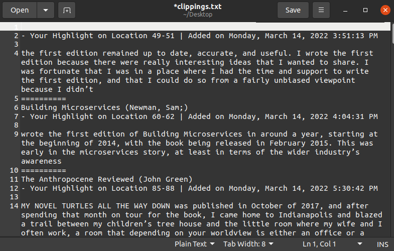
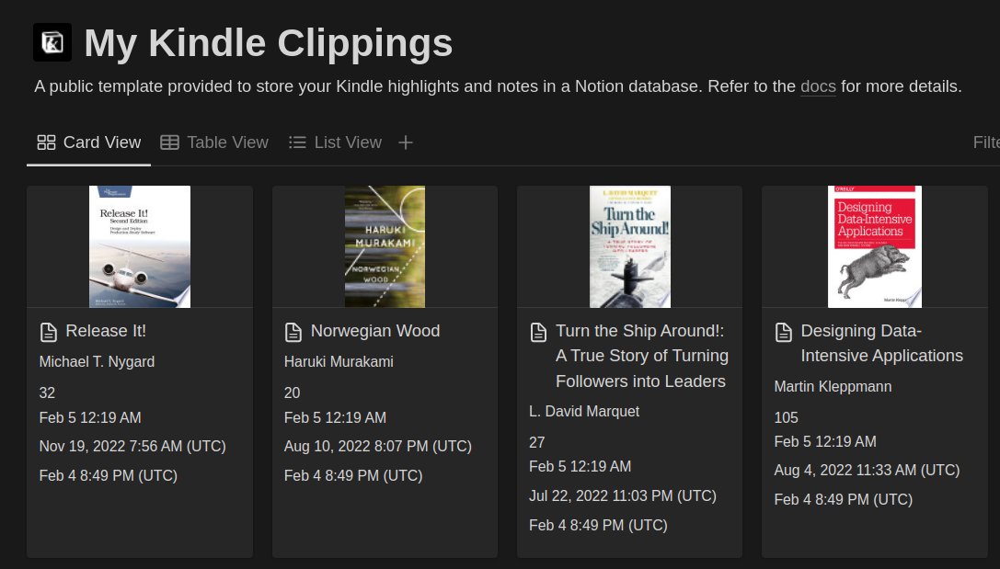

هایلایت‌ کردن کتاب‌های ناداستان و کتاب‌های فنی برای من خیلی مهمه. هم از این جهت که می‌تونم کتاب‌هایی که قبلاً هایلایت کردم رو  در چند دقیقه مرور کنم، و هم این که موقع هایلایت کردن بخشی از متن، تمرکز بیشتری روی اون قسمت دارم.
یکی از مزیت‌های برجسته‌ٔ خوندن کتاب با کتابخوان‌ها، بهتر بودن تجربهٔ هایلایت کردنه. بدون نیاز به وسیلهٔ جانبی می‌تونی هایلایت‌کنی و بعداً هم خیلی سریع و با طبقه‌بندی مناسبی می‌تونی سراغشون بری. اما وقتی تعداد این هایلایت‌ها زیاد می‌شن جستجو کردن بیشنشون سخت‌تر می‌شه و پیدا کردن هایلایت مورد نظر بین کتاب‌ها و فصل‌ها کار آسونی نیست.

این شد که تلاش کردم تا راهی پیدا کنم که در جایی غیر از خود دستگاه کتابخوان این هایلایت‌ها رو داشته باشم؛ تا هم ماندگارتر باشه و هم بشه راحت‌تر جستجو کرد. خود کیندل امکانات خوبی برای اکسپورت این هایلایت‌ها میده و با ابزارهای خیلی خوبی مثل [Readwise](https://readwise.io/) و یا [Goodreads](https://www.goodreads.com/) انطباق‌پذیری خوبی داره. ولی این امکانات یا فقط برای کتاب‌هایی که از خود آمازون خریداری شده باشه قابل استفاده است یا سرویسشون پولیه و برای ما که امکان انتقال پول نداریم عملاً قابل استفاده نیست. من تلاش کردم راهی رایگان پیدا کنم تا هایلایت‌های کتاب‌هایی هم که از آمازون خریداری نشدن رو منتقل کنم.

من برای نگهداری سندهام از [Notion](https://www.notion.so/) استفاده می‌کنم. اینجا می‌خوام روش‌هایی که برای انتقال این هایلایت‌ها به یک سند نوشن استفاده کردم رو بنویسم.

## فایل My Clippings.txt
تمامی هایلایت‌های کیندل به صورت فیزیکی در هارد دستگاه و در یک فایل به اسم `My Clippings.txt` توی پوشه `documents` نگهداری می‌شه. بهتره که قبل از هرکاری، این فایل رو روی کامپیوتر خودتون `copy` کنید. حواستون باشه فایل رو `cut` یا `delete` نکنید چون هایلایت‌هاتون توی دستگاه پاک می‌شه.

این فایل به صورت خام هم قابل استفاده است و با ابزارهای ساده‌ای مثل notepad ویندوز و یا هر ویرایشگر متن دیگه‌ای قابل مشاهده است.

## انتقال هایلایت‌ها به Notion
در اینجا چند روش برای تبدیل این فایل خام `My Clippings.txt` به یک سند قابل فهم‌تر و خوانا‌تر نوشن رو می‌نویسم.

### راه آسان: افزونه Export Kindle Highlights to Notion
من مدتی از این افزونه گوگل کروم استفاده می‌کردم و جوابگو بود. در [این لینک](https://www.notion.so/KindleToNotion-How-To-Guide-Easy-bce19dae7fae4cde93440ece213ba5ed) به صورت تصویری آموزش استفاده ازش نوشته شده. افزونه رو می‌تونید از [اینجا](https://chrome.google.com/webstore/detail/export-kindle-highlights/nmgbhgbkbenpfjkdfladebgcdihbekne) دانلود کنید.
- نکته: این افزونه از یک زمانی به بعد برای من کار نکرد. البته پی دلیلش رو نگرفتم و ممکنه کماکان قابل استفاده باشه.

### راه سخت‌تر: نرم‌افزار متن‌باز kindle2notion
برای این راه نیاز دارید که python3 بر روی سیستم‌عامل شما نصب باشه. می‌تونید توضیحات رو از [ریپازیتوری پروژه](https://github.com/paperboi/kindle2notion) ببینید. من مدتیه که از این روش استفاده می‌کنم.

---

اگر راه دیگری برای انتقال هایلایت‌های کیندل به نوشن می‌شناسید و یا این که راه بهتری برای استفاده از هایلایت‌ها سراغ دارید خوشحال می‌شم توی کامنت‌ها بنویسید تا به محتوای اولیه اضافه کنم.