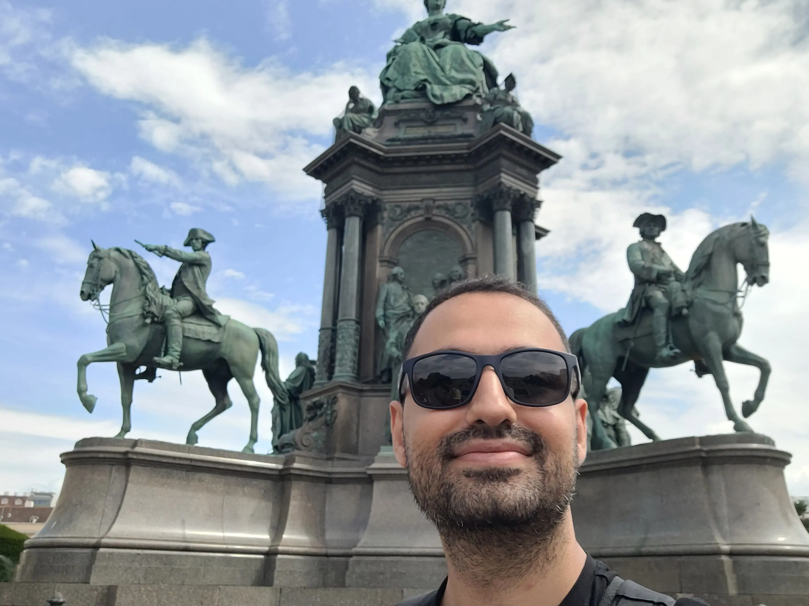

The highlight of this year for me was moving to Germany (from Iran) and working for a new company. This simple sentence affected all aspects of my life: the language, relationships, workplace, and products I work on. It was an intense and chaotic year for me, and at the same time, it was full of new experiences.

## Language

I was born and raised in a Kurdish family and environment. When I was 18, I moved to the capital of Iran, a Persian city, to start my bachelor's at university. For 9 years, Persian was my main language in my daily life. This year, when I started my new job in Germany, I had a switch again. English became my main language for work and communication with colleagues, and German became my language for communicating with people in the city and a tool to integrate into the new society.

Interestingly, now I speak four languages every day! Although it is cool to speak different languages and all my childhood, I dreamed about it, but I admit it is hard. For many years, I was exposed to English by reading and listening, but it was not as easy to speak fluently as my mother tongue. However, now I feel much more comfortable with my mistakes and elaborate more when someone does not understand what I have said on the first try. After regaining my self-confidence, I started to present tech talks to my team. On the other hand, my German is a level at which I can start and participate in very simple conversations. Currently, I am taking an A2-level German course.

## Culture Map

For the first time in my life, I am working in a team with more than one nationality. Specifically, we have colleges from 10 different nationalities. As soon as I joined the team, I realized that some cultural differences could affect communication between colleagues. My manager suggested that I read the [Culture Map](https://amzn.to/49Pme0l) book.

This book was a complete eye-opener. I could never imagine that some of the basics I grew up with could be entirely different for people who grew up in other environments. Knowing this difference makes communication so much easier for me. Now, instead of putting wrong or right labels on different communication styles, I can first understand them and then try to adapt myself to different situations.

## New Product

In the last few years, I have mostly worked on established products. Even though I started a new product, external teams maintained all of the basics, like infrastructure and observability requirements, so I mainly focused on the product and business logic.

This year, I had the opportunity to start a project with a startup-like team. It is exciting to write the first lines of code, witness the first production deployment, the first customers, and own many smaller domains that usually have their own team when the product is big enough.

On the other hand, I realized that prioritization for this kind of team is more complex and critical than for an established product. Sometimes, you have to choose to work on one of several areas and sacrifice others for a period of time, all of which are important in the final product.

## Travel

Germany is located on a beautiful continent with very beautiful countries as neighbors. Here, the work law allows you to spend a good amount of time on vacation without worrying about work responsibilities.

In the last seven months, I have visited four countries and more than fifteen cities. This could be a record for me :) I wandered the majesty of Venice's alleys, hiked in the [Thuringian Forest](https://en.wikipedia.org/wiki/Thuringian_Forest), rode a boat on the Amsterdam canals, and was amazed by the beauty of Vienna.

## Writing

This year, I wrote more, including blog posts, journals, notes from books, articles, YouTube videos, and so on. I also became more comfortable with writing and discovered my preferred style.

In addition to my journal and personal notes, I have written publicly on software engineering and leadership topics. If you are a Persian reader, you can subscribe to my [telegram channel](https://t.me/aminrbg). I also write on this blog and [X](https://x.com/AminRashidbeigi) in English. I have published eight blog posts here this year:

- [Managing Overdue Tasks](https://aminrb.me/managing-overdue-tasks/)
- [Vector Search: An Introduction](https://aminrb.me/vector-search-introduction/)
- [My Thoughts on The Clean Coder Book](https://aminrb.me/the-clean-coder/)
- ["Sorry", Is That Enough?](https://aminrb.me/actions-after-mistakes/)
- [Expedition Diaries: A Project to Learn](https://aminrb.me/expedition-diaries/)
- [When to Start Secret Rotation](https://aminrb.me/secret-rotation/)
- [Run Llama 3 Locally](https://aminrb.me/run-llama-locally/)
- [Go Test Doubles by Example](https://aminrb.me/go-test-double/)

It is worth mentioning that Notion was previously my main writing tool, but I had some major problems with it:

- **Privacy**: Saving everything I wrote on one platform did not feel good to me.
- **Offline Mode**: Its offline support was not that good that I can rely on (at least in the free version).
- **RTL support**: I waited several years for Notion to implement support for right-to-left languages such as Persian or Kurdish, but I was finally disappointed.

So, I started using Obsidian. It was far better than I expected, specifically after spending some hours configuring it to become a tool I am comfortable with. I also use [Syncthing](https://syncthing.net/) to sync my notes between different devices.

## Productivity

Having multiple priorities made it harder for me to follow all my goals and responsibilities. For some time, I was unhappy about my progress, and I felt that I was juggling different areas of my life without feeling noticeable changes. It made me learn and apply productivity tools and techniques more seriously. It has been months since I introduced the [GTD](https://amzn.to/4gx2gKc) system to my daily life and added a to-do list to my daily tools. It helped me organize my priorities and focus on what I am doing. But still, there is a lot of room for improvement since it is a process you can always improve.

## Next year's goals

Due to many changes and not being stable this year, I have neglected my healthy diet and workouts, which I should not compensate for. So, I want to get back to my workout and diet routine. I want to continue the habit of writing my experiences and findings. I also want to continue improving my German. My goal is to reach the B1 level in the next year. The last goal is to have public speaking in Meetups or Conferences.
