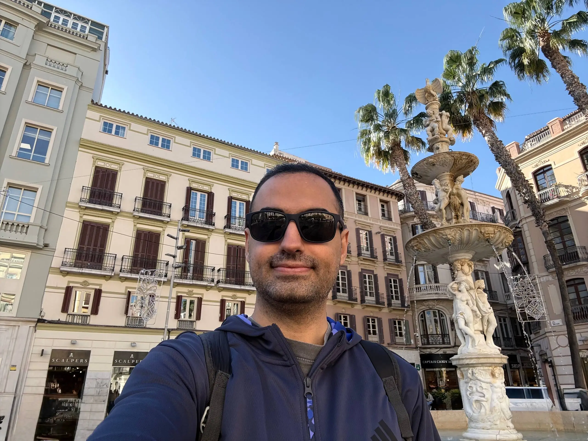

Looking back, this year was shaped by a series of changes in both my life and my work, from where I live, to where I work, and the biggest one of all, getting married.

## Work

In July, I left CHECK24 to join Delivery Hero.

I moved from a small team working on a young product, where we were building an MVP, getting the first orders, and owning many parts of the system, to a well-established organization with tier-1 services that handle thousands of requests per second across more than 70 countries.

The challenges, especially around distributed systems and working across time zones, pushed me beyond my previous experience and reshaped how I think about scale and reliability.

## Life

The biggest change this year was getting married. Having two ceremonies, one Persian and one Kurdish, made it even more meaningful and allowed us to celebrate not just marriage, but our cultures as well.

Apart from that, after 1.5 years in peaceful Erfurt, I moved to Berlin in the summer. It’s a city that always has something to offer, and I now understand why people say living here is a very different experience.

## Travel

Although this year was super busy, I still managed to visit some new places. I visited magical Paris, the beautiful beaches of La Maddalena in Sardinia, the majesty of Cologne’s Dom, and finished the year with a solo trip to the south of Spain, experiencing the culture of Flamenco in Málaga.

I have also created a page containing the countries I have visited, coloring them one by one in my yearly updates: [Countries I Have Visited](/visited-countries).

## Speaking and Writing

As it was a goal in my 2024 yearly review, I started giving talks on topics I am more interested in. That’s why I had some [talks on different topics](https://github.com/aminrashidbeigi/talks), such as AI changes and their role in software development, as well as sustainability in software engineering.

Regarding writing, my main focus was on my Telegram channel for my Persian readers. I posted more than 50 posts, including series on [how to increase the chance of getting interviews](https://t.me/aminrbg/78), [how AI is changing the industry](https://t.me/aminrbg/66) and also [how to increase ownership within the team](https://t.me/aminrbg/52).

## Side Projects

This year, I decided to make my side projects public so that not only I but also others could use them. With the wave of amazing new AI and non-AI tools, this became much easier.

I am always reading new blog posts and listening to podcasts from people I follow. Previously, I used several feed readers, but all the tools I tried had limitations, and I couldn’t customize them as much as I wanted. So I created my own tool: [TechGrub](https://t.me/TechGrub). A Telegram channel that sends one post daily with some basic information and an AI-generated super short summary. You can also join it, and yes, it’s free.

Then I vibe-coded [MatchaGift](https://matcha.gift/), a tool that helps people find meaningful and customized gifts for friends and family. It started as a fun experiment in fast prototyping. Even though I did not continue working on it, it helped me explore several ideas.

I also refocused on [mentorship](https://aminrb.me/ways-i-can-help/), conducting 30+ sessions with software engineers. Most of these mentorship sessions were with software engineers navigating career transitions, interviews, or growth within their teams.

## 2026 Plans

Besides the usual work- and life-related yearly goals, one of my main focuses for the next year is to integrate more into German culture and the country. I want to focus on the language and also try to get my driving license, since my previous one is not convertible.
