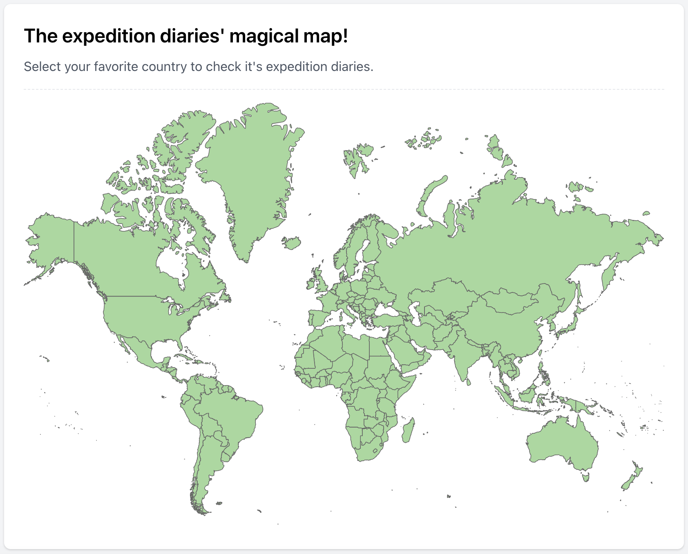

Some days ago, I received a final warning email about the expiry of the expedition-diaries.com domain.

A few years ago, I set a challenge for myself to start a project and manage all its aspects like backend, frontend, and infrastructure on my own. I had experience in each of these areas separately but never had the chance to develop them together. Plus, I had different goals for each part:

- **Backend (Go)**: I wanted to experiment with various libraries and architectures.
- **Frontend (Vue.js)**: I wanted to refresh my knowledge. I also thought about giving React a try.
- **Infrastructure**: I was less experienced in this area and wanted to experience and learn some.

### Expedition Diaries

One thing that mattered most to me was to create something useful, both for myself and others, and not just let it sit on my GitHub archive.

So, I went through my idea list to find a project that aligned with my goals. I’ve always been fascinated by old travelogues. I love discovering who passed through different lands and seas, what they observed, and what was going through their minds. But finding this information isn't easy. Travel accounts are scattered arround internet and libraries, and the other problem is that aligning historical locations with today’s cities and countries is quite a challenge.

That’s how the idea for *Expedition Diaries* was born. The goal was to categorize old travelogues, including travelers, timelines, and, most importantly, the countries they passed through. Eventually, I wanted to have a world map where you could click on a country and see the related travel accounts.

I had so much fun working on this project. Every weekend, I excitedly moved it forward, and in the end, it became something ready to be shared publicly. You can check it out [here](https://expedition-diaries.com/)

### What did I learn from it?

- After a long time, I got back into frontend development. I realized I can still build a website, even if it wasn’t top-notch quality.
- I wrote a Go project from scratch and experimented with many libraries and structures along the way.
- I gained hands-on experience with infrastructure, working on areas like Nginx and CDN. I also used [GitHub Actions](https://docs.github.com/en/actions) for the first time.

### What happened in the end?

First and foremost, I gained a lot of valuable experience that I’ve used in the companies I’ve worked at and in job interviews.

And regarding the project itself, my initial goal was to keep expanding the travelogue database until it became a solid reference, eventually gaining traffic from Google. But shortly after launching it, ChatGPT and other LLMs became popular, and they covered the needs and goals of the project quite well. Based on that and also given the time that I needed to spend on the projectd, I decided not to continue.

### Wrapping Up

Going back to the first sentence, I probably won’t renew the domain, and like [many other projects](/side-projects/), it will only be accessible through [archive.org](https://archive.org/). However, if you’re interested in the idea or see potential, feel free to reach out and let’s talk :)
