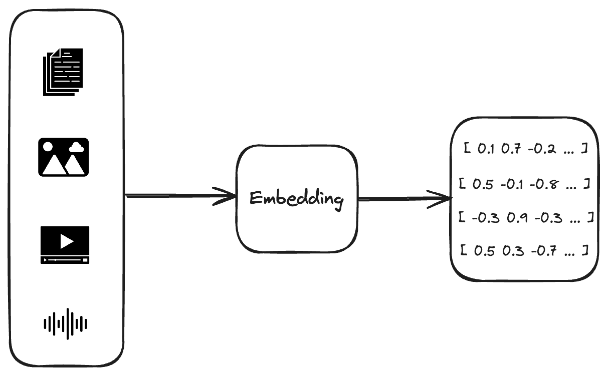
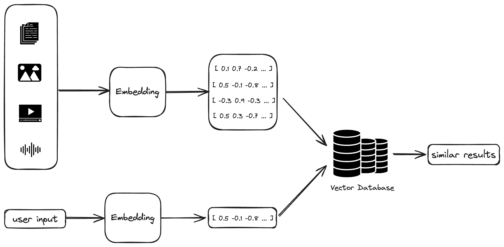

## What Is Vector Search?

We've come to understand searching as a job of comparing text. We grew up Googling things, looking up words in dictionaries, and finding book titles in libraries. But there are tons of other types of media packed with information we might need, like images, videos, and audio. What if you want to find a specific word in an audiobook, or you're trying to locate a scene with a red Ferrari in action movies? That's where vector search comes in.

## When to Use Vector Search?

If your business has a search feature, you can potentially improve it by using vector search. Vector search generally improves the chances of finding what you're looking for, no matter the data type. To give you some ideas, Netflix uses vector search to locate objects in movie frames, while Pinterest employs it to search for images related to specific text.

Vector search isn't just for non-text media, though. It can understand the context of textual content just like a human, something simple searches can't do. This ability allows for more accurate search results even if the text contains misspellings or uses different words with the same meaning.

There are many other applications for vector search besides just looking things up. It can power recommendation systems, detect duplicates, find anomalies, and complete other tasks as well.

## How It Works?

To implement vector search, you need some key components, which I'll explain here:

### Embedding

First, you need a component that turns your input into a multidimensional vector. This is usually a machine learning model trained to pull out information from the input and assign numeric values to it based on this information. The required dimensionality varies with the precision you want and the specific model you use for embedding.

As an example for embedding component, you can look into [word2vec](https://en.wikipedia.org/wiki/Word2vec).

### Vector Database

Another key component is a vector database that holds the embeddings of documents and allows for similarity searches. There are many databases out there that supporting vector search, including [Elasticsearch](https://www.elastic.co/enterprise-search/vector-search), [Redis](https://redis.io/), [Milvus](https://milvus.io/), and [Vespa](https://vespa.ai/), among others.

### Putting It All Together

Now, let's see how everything fits.

Vector search works in two phases. Initially, there's a background task where you calculate and store all the embeddings using embedding component and vector database.

Then, when users make a search, their queries are transformed into embeddings, and a similarity search is performed. Vector databases usually come with built-in similarity measures like [KNN](https://en.wikipedia.org/wiki/K-nearest_neighbors_algorithm) (k-nearest neighbors) or ANN (approximate nearest neighbors), and they use functions like [cosine similarity](https://en.wikipedia.org/wiki/Cosine_similarity) to compute how similar the entries are. You can also develop your custom similarity search function.

After conducting a similarity search, you'll have a list of candidates that are closest to the user's query, which you then present as the search results.

## Conclusion

Vector search is a powerful tool that can help you more effectively explore various types of data. Whether you're developing a new search feature for your product or enhancing an existing one, understanding and utilizing vector search can lead to improved search experiences.

Although vector search offers many benefits, it also has its drawbacks. The most significant of these is the challenge of interpretability and understanding how the model perceives objects as similar to each other.
